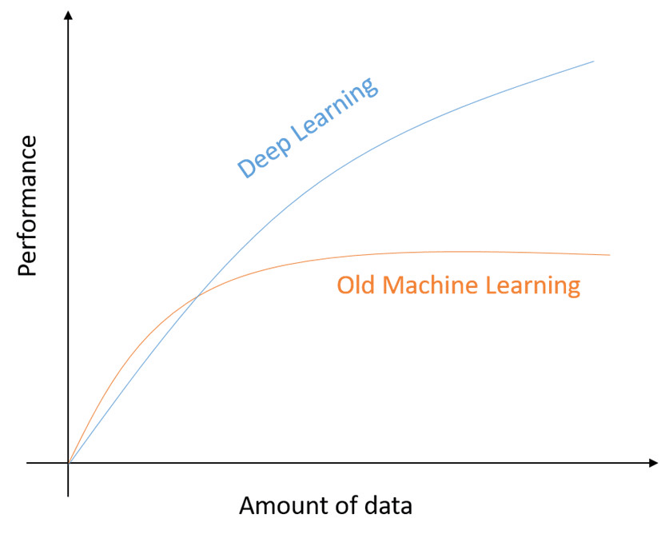

# Day 2: AI vs ML vs DL

Artificial Intelligence (AI), Machine Learning (ML), and Deep Learning (DL) are terms that are often used interchangeably, but they are actually different concepts.

## Artificial Intelligence (AI)

AI refers to the ability of machines to perform tasks that typically require human intelligence, such as visual perception, speech recognition, decision-making, and natural language processing. AI can be either rule-based or learning-based.

## Machine Learning (ML)

Machine learning is a subset, an application of Artificial Intelligence (AI) that offers the ability to the system to learn and improve from experience without being programmed to that level. Machine Learning uses data to train and find accurate results. Machine learning focuses on the development of a computer program that accesses the data and uses it to learn from itself.

## Deep Learning

Deep Learning is a subset of Machine Learning that uses artificial neural networks to identify patterns in data. Neural networks are composed of layers of interconnected nodes that process information. In the case of image recognition, the neural network would use the input of pixel values from an image and learn to recognize the patterns that distinguish dogs from cats by adjusting the weights of the connections between nodes. The more layers a neural network has, the more complex patterns it can recognize.

## Limitations of Deep Learning

While Deep Learning has shown great success in tasks such as image recognition and natural language processing, it is not always the best approach. Deep Learning requires a large amount of labeled data to train the neural network, which can be time-consuming and expensive to collect.

## Performance vs Amount of Data Graph

The graph above shows the relationship between the amount of labeled data and the performance of a Machine Learning or Deep Learning model. As the amount of labeled data increases, both types of models improve in performance. However, Deep Learning models tend to have a steeper increase in performance with more data. At a certain point, the performance of a Machine Learning model may plateau, while a Deep Learning model can continue to improve with more data.

#
In summary, AI, ML, and DL are distinct concepts that are used in different ways to achieve different goals. While AI refers to the ability of machines to perform tasks that typically require human intelligence, ML and DL are subfields of AI that focus on learning from data without being explicitly programmed. DL, in particular, uses neural networks with many layers to model and solve complex problems.

