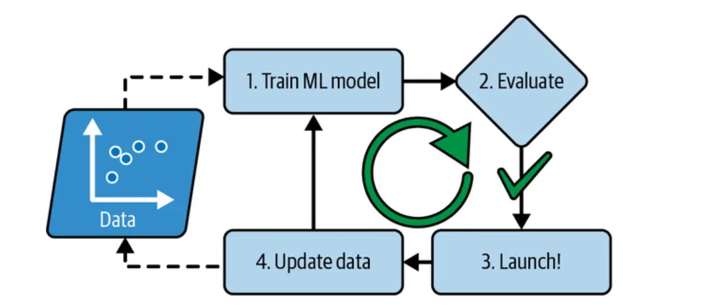

# Day 4: Batch or Offline Vs Online Machine Learning

Batch learning and online learning are two different approaches to machine learning that have their own advantages and disadvantages. In this documentation, we will explore batch learning, the problems associated with it.

## Batch Learning

Batch learning is a machine learning approach in which models are trained periodically in batches at regular intervals. The models are trained using all the available data each time, as opposed to incremental learning. Data accumulates over time, and the models are trained with the accumulated data at periodic intervals, which can require a significant amount of time and computing resources. This is why batch learning is typically done offline. Once the models are trained, they are deployed into production, and they run without further learning.

Batch learning is also referred to as offline learning. The models trained using batch or offline learning are moved into production only at regular intervals, based on the performance of the models trained with new data.

## Disadvantages of Batch Learning

### Lots of Data

Batch Learning requires a large amount of data to train the model. In some cases, the data might not be available at once or it might be collected over time, which makes it difficult to use Batch Learning.

### Hardware limitations

Hardware limitations in machine learning refer to the constraints that arise due to limited computing power, storage capacity, and network bandwidth. These limitations can have a significant impact on the performance and scalability of machine learning models.

### Availability

Batch learning is a slow process and requires a lot of computational resources. This can be a problem for applications that require real-time predictions, such as news sections on a website, which need to be updated frequently.

