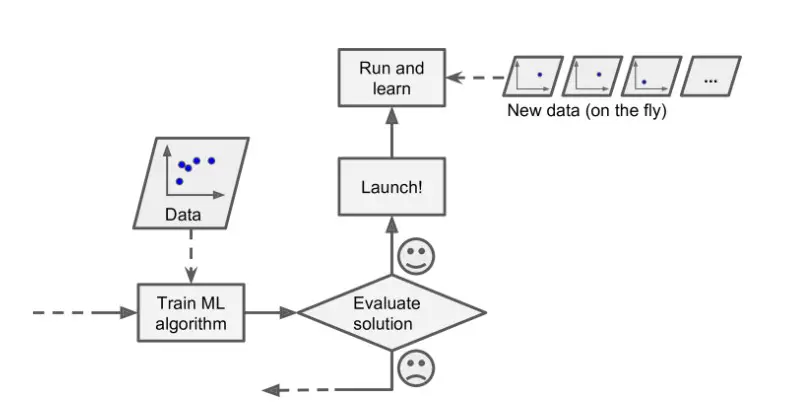
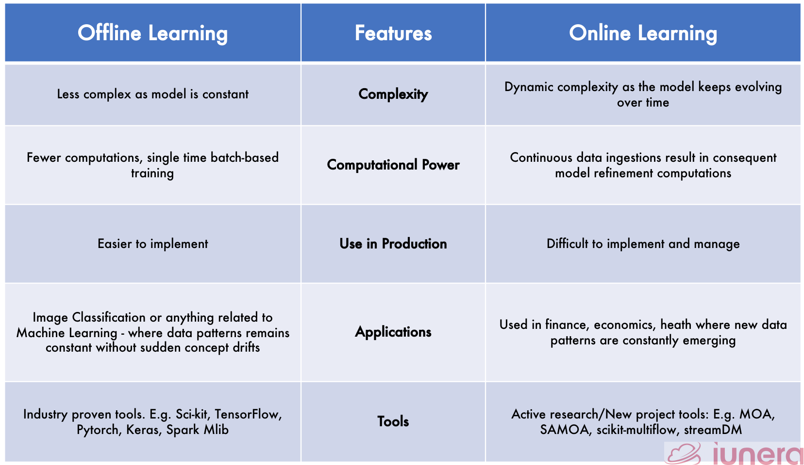

# Day 5: Online Machine Learning

Online learning, also known as incremental learning or continuous learning, is a machine learning approach where the system learns from data on the go, one example at a time. Unlike batch learning, where the model is trained with all the available data at once, online learning updates the model continuously and incrementally with each new example.

A good example of online learning is YouTube's recommendation system. As a user watches videos, the system updates its understanding of their preferences and recommends new videos based on their viewing history.

## When To Use

There are several situations where online learning is useful:

### When there is a concept drift:
Concept drift refers to the situation where the underlying distribution of the data changes over time. In such cases, it is essential to update the model continuously to maintain its accuracy.

### Cost-effective: 
Online learning is more cost-effective than batch learning, as it does not require expensive hardware resources to store and process large datasets.

### Faster solution: 
Online learning allows the model to learn from new data in real-time, providing faster solutions to problems.

## How to Implement

To implement online learning, the data is fed into the model in a sequential manner, rather than all at once in a batch. This requires the use of algorithms and libraries that support incremental learning, such as River, and Vowpal Wabbit. These libraries allow for the model to be updated with new data on-the-fly, without having to retrain the entire model each time. 

## Learning Rate

In machine learning, when training a model, we want to adjust its parameters so that it can make accurate predictions. The learning rate is like the size of the steps we take when adjusting those parameters. If the learning rate is too high, we might overshoot the optimal values and end up with a less accurate model. If it's too low, we might take too many small steps and the training process could take a long time. So, choosing the right learning rate is important for getting the best results from our machine learning model.

## Out of Core Learning

Out-of-core learning or incremental learning is a technique used to handle large datasets that are too big to fit into the memory of a single machine. It works by processing the data in small chunks, one at a time, and updating the model as it goes. This way, the model can learn from large datasets without needing to store all the data in memory at once.

## Disadvantages of Machine Learning

Online learning is a powerful tool, but it comes with its challenges. One of the main challenges is that it can be tricky to use and risky, as models can make incorrect predictions or reinforce existing biases. To overcome these challenges, it is essential to monitor the model's performance and adjust the learning rate and other hyperparameters as needed. 

## Online vs Offline Learning

