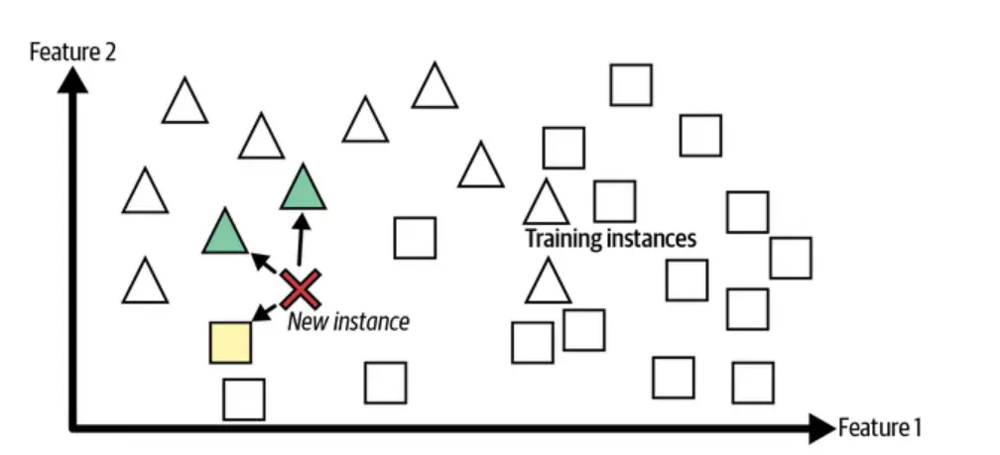
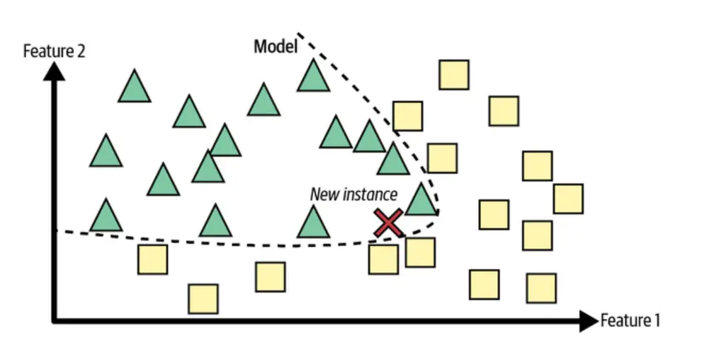
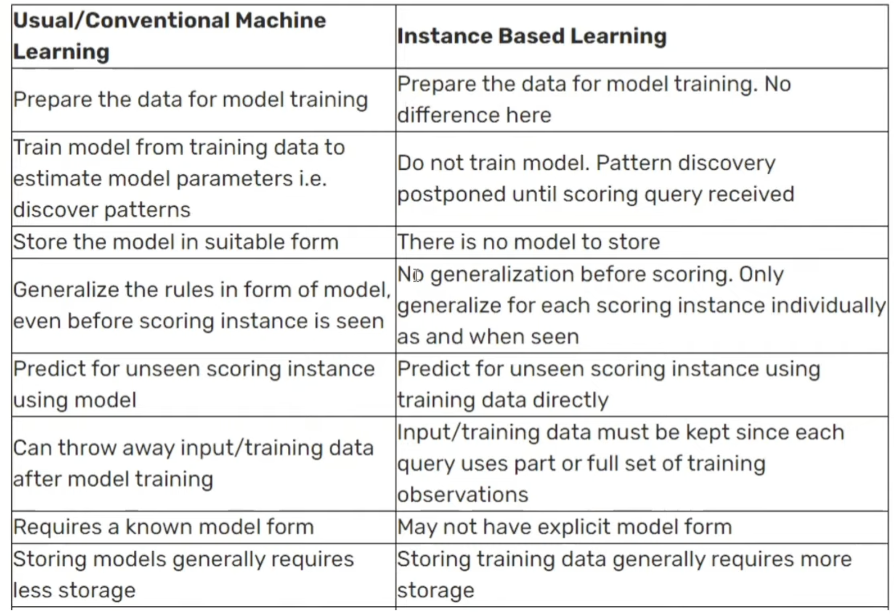

# Day 6: Instance-Based vs Model-Based Learning

In machine learning, there are two main ways of learning: memorization (also known as instance-based learning) and generalization (also known as model-based learning).

## Instance-Based Learning

In instance-based learning, the system learns the training data by heart. At the time of making prediction, the system uses similarity measure and compare the new cases with the learned data. K-nearest neighbors (KNN) is an algorithm that belongs to the instance-based learning class of algorithms.  
The picture below demonstrates how the new instance will be predicted as triangle based on greater number of triangles in its proximity.

 

## Model-Based Learning

Model-based learning (also known as structure-based or eager learning) takes a different approach by constructing models from the training data that can generalize better than instance-based methods. This involves using algorithms like linear regression, logistic regression, random forest, etc.  
The picture below represents how the prediction about the class is decided based on boundary learned from training data rather than comparing with learned data set based on similarity measures.

## Differences between Instance-Based vs Model-Based Learning

