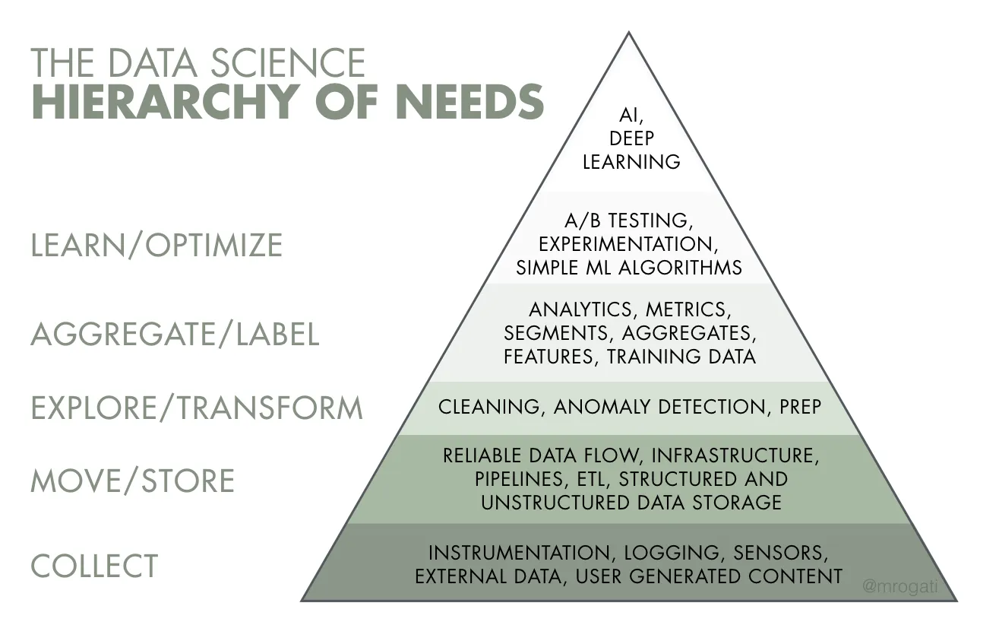
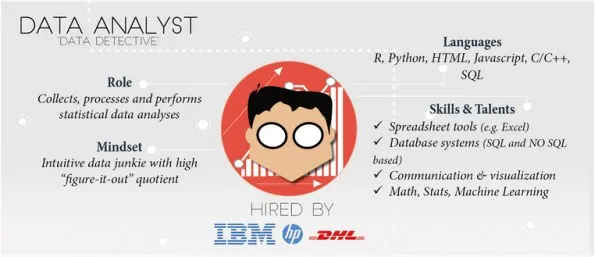
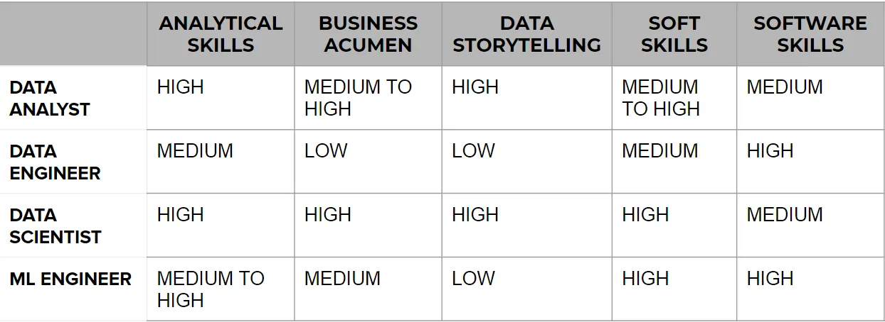

# Various Data Based Job Roles
This article explores various job roles in data science and machine learning. It will cover job titles such as Data Analyst, Data Scientist, Data Engineer, and Machine Learning Engineer, discussing the responsibilities and skills/qualifications.

## DATA ANALYST
Data analysis is a process of inspecting, cleansing, transforming and modeling data to discover useful information, informing conclusions and supporting decision-making. Data analysts collect, process and perform statistical analysis on the given data.

### Responsibilities of a Data Analyst
• Cleaning and organizing Raw data.   
• Analyzing data to derive insights.  
• Creating data visualizations.  
• Producing and maintaining reports.  
• Collaborating with teams/colleagues based on the insight gained.  
• Optimizing data collection procedures.  
• Skills required to be a data analyst

### A strong foundation in the following skills is beneficial in developing a career as a data analyst
• Mathematics  
• Computer Science  
• Statistics

### Furthermore, additional skills required to be a data analyst are:
• Statistical Programming  
• Programming Languages (R/SAS/Python)  
• Creative and Analytical Thinking  
• Business Acumen — Medium to High preferred  
• Strong Communication Skills.  
• Data Mining, Cleaning, and Munging  
• Data Visualization  
• Data Warehousing  
• Data Story Telling  
• SQL Databases  
• Database Querying Languages  
• Advanced Microsoft Excel.

## DATA SCIENTIST

“A data scientist is someone who is better at statistics than any software engineer and better at software engineering than any statistician”. — Josh Wills on Quora

A data scientist is responsible for using statistical and machine learning techniques to extract insights from data. Their role is more forward-looking and focuses on using insights for further development of products. The skills required to be a data scientist include:  
• Data analysis  
• Mathematics  
• Machine learning  
• Deep learning  
• Reinforcement learning  
• Hypothesis testing  
• Subject matter expertise (SME)  
• Intuition  
Data scientists must have a strong foundation in data analysis and statistics, as well as the ability to apply machine learning algorithms to large datasets. They must also have subject matter expertise in the industry they work in, allowing them to ask the right questions and interpret the results correctly. Intuition and creativity are also crucial for identifying patterns in the data that may not be immediately obvious.

## DATA ENGINEERS
Gordon Lindsay Glegg once quoted, “A scientist can discover a new star, but he cannot make one. He would have to ask an engineer to do it for him.”  
So, the role of the Data Engineer is really valuable.  
Data Engineers are people who are in charge of the delivery, storage, and processing of data. The main task of data engineers is to provide a reliable infrastructure for data. If we look at the AI Hierarchy of Needs, data engineering occupies the first 2–3 roles in it: Collect, Move & Store, Data Preparation.

### Responsibilities of Data Engineer
• Scrape Data from the given sources.  
• Move/Store the data in optimal servers/warehouses.  
• Build data pipelines/APIs for easy access to the data.  
• Handle databases/data warehouses.  

### Skills required to be a Data Engineer
• Strong grasp of algorithms and data structures  
• Programming Languages (Java/R/Python/Scala) and script writing  
• Advanced DBMS’s  
• BIG DATA Tools (Apache Spark, Hadoop, Apache Kafka, Apache Hive)  
• Cloud Platforms (Amazon Web Services, Google Cloud Platform)  
• Distributed Systems  
• Data Pipelines  

## MACHINE LEARNING ENGINEER
A Machine Learning Engineer bridges the gap between Data Scientist’s work and production environment, focusing on deploying production-ready models. They integrate the model into a software system, optimize it for performance and scalability, retrain it with new data, and monitor and maintain the ML system. The Engineer is responsible for ensuring that the model is production-ready, which is different from building the model.

### Responsibilities of Machine Learning Engineers:
• Deploying machine learning models to production ready environment  
• Scaling and optimizing the model for production  
• Monitoring and maintenance of deployed models

### Skills required to be a Machine Learning Engineers:
• Linear Algebra, Calculus  
• Probability and Statistics  
• Programming Languages (R/Python/Java/Scala mainly)  
• Distributed Systems  
• Data model and evaluation  
• Machine Learning models  
• Software Engineering & Systems desig

## COMPARISION

