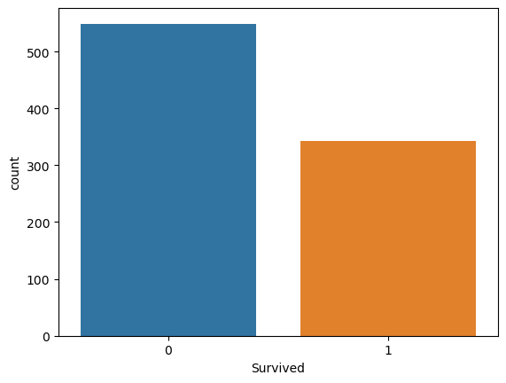
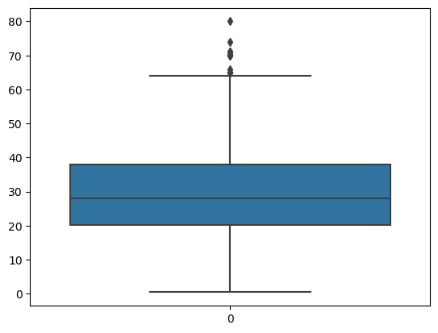

# Day 18: Exploratory Data Analysis (EDA) Using Univariate Analysis

In this documentation, I will cover the basics of Exploratory Data Analysis (EDA) using Univariate Analysis. EDA is an important step in the data analysis process that allows us to understand the characteristics of the data we are working with.

## What is EDA?
Exploratory Data Analysis (EDA) is the process of exploring and analyzing data sets to summarize their main characteristics.With EDA, you can see patterns, trends, and relationships between the different pieces of data. This helps you to understand what the data is all about and make better decisions based on it.


## Types of EDA
There are two main types of EDA:

### Univariate Analysis: 
Univariate Analysis involves analyzing one variable at a time to understand its distribution, central tendency, and variability. This type of analysis is useful for understanding the characteristics of individual variables, such as their range, mode, and mean.

### Bivariate Analysis:
Bivariate analysis is an EDA technique used to analyze two variables to determine if there is a relationship between them. This type of analysis is useful when trying to identify patterns or relationships between two variables.

### Multivariate Analysis
Multivariate Analysis, involves analyzing multiple variables simultaneously to understand the relationships between them. This type of analysis is useful for identifying patterns and correlations between variables, as well as detecting outliers and anomalies.


#### In this documentation, I will focus on the Univariate Analysis method.


## Types of Data
There are two main types of data: categorical data and numerical data.

### Categorical Data
Categorical data is data that can be divided into categories. Examples of categorical data include gender, race, and type of car. We can use univariate analysis to calculate the frequency of each category and to visualize the distribution of the data.

### Numerical Data
Numerical data is data that consists of numbers. Examples of numerical data include height, weight, and age. We can use univariate analysis to calculate the mean, median, and mode of the data, as well as to visualize the distribution of the data using histograms, box plots, or density plots.

## Univariate Analysis

In this example, we will perform univariate analysis on a dataset.


```python
import pandas as pd
import seaborn as sns
import matplotlib.pyplot as plt
```


```python
df = pd.read_csv('train.csv')
```


```python
df.head()
```


<div>
<style scoped>
    .dataframe tbody tr th:only-of-type {
        vertical-align: middle;
    }

    .dataframe tbody tr th {
        vertical-align: top;
    }

    .dataframe thead th {
        text-align: right;
    }
</style>
<table border="1" class="dataframe">
  <thead>
    <tr style="text-align: right;">
      <th></th>
      <th>PassengerId</th>
      <th>Survived</th>
      <th>Pclass</th>
      <th>Name</th>
      <th>Sex</th>
      <th>Age</th>
      <th>SibSp</th>
      <th>Parch</th>
      <th>Ticket</th>
      <th>Fare</th>
      <th>Cabin</th>
      <th>Embarked</th>
    </tr>
  </thead>
  <tbody>
    <tr>
      <th>0</th>
      <td>1</td>
      <td>0</td>
      <td>3</td>
      <td>Braund, Mr. Owen Harris</td>
      <td>male</td>
      <td>22.0</td>
      <td>1</td>
      <td>0</td>
      <td>A/5 21171</td>
      <td>7.2500</td>
      <td>NaN</td>
      <td>S</td>
    </tr>
    <tr>
      <th>1</th>
      <td>2</td>
      <td>1</td>
      <td>1</td>
      <td>Cumings, Mrs. John Bradley (Florence Briggs Th...</td>
      <td>female</td>
      <td>38.0</td>
      <td>1</td>
      <td>0</td>
      <td>PC 17599</td>
      <td>71.2833</td>
      <td>C85</td>
      <td>C</td>
    </tr>
    <tr>
      <th>2</th>
      <td>3</td>
      <td>1</td>
      <td>3</td>
      <td>Heikkinen, Miss. Laina</td>
      <td>female</td>
      <td>26.0</td>
      <td>0</td>
      <td>0</td>
      <td>STON/O2. 3101282</td>
      <td>7.9250</td>
      <td>NaN</td>
      <td>S</td>
    </tr>
    <tr>
      <th>3</th>
      <td>4</td>
      <td>1</td>
      <td>1</td>
      <td>Futrelle, Mrs. Jacques Heath (Lily May Peel)</td>
      <td>female</td>
      <td>35.0</td>
      <td>1</td>
      <td>0</td>
      <td>113803</td>
      <td>53.1000</td>
      <td>C123</td>
      <td>S</td>
    </tr>
    <tr>
      <th>4</th>
      <td>5</td>
      <td>0</td>
      <td>3</td>
      <td>Allen, Mr. William Henry</td>
      <td>male</td>
      <td>35.0</td>
      <td>0</td>
      <td>0</td>
      <td>373450</td>
      <td>8.0500</td>
      <td>NaN</td>
      <td>S</td>
    </tr>
  </tbody>
</table>
</div>


### 1. Categorical Data

#### a. Countplot 
It is a type of plot in which the data is displayed in bars and the height of each bar represents the count or frequency of observations in each category. 


```python
sns.countplot(x= 'Survived', data = df )
```


    <Axes: xlabel='Survived', ylabel='count'>


    

    


#### b. PieChart
It is a graphical representation of data in a circular form where the size of each slice is proportional to the quantity it represents.


```python
df['Sex'].value_counts().plot(kind='pie', autopct='%.3f')
```


    <Axes: ylabel='Sex'>


    

    


### 2. Numerical Data

#### a. Histogram
It is a graphical representation of the distribution of numerical data. It consists of a set of rectangles, where each rectangle represents a group or "bin" of data values, and the height of the rectangle represents the frequency or count of data values in that bin.


```python
plt.hist(df['Age'])
```


    (array([ 54.,  46., 177., 169., 118.,  70.,  45.,  24.,   9.,   2.]),
     array([ 0.42 ,  8.378, 16.336, 24.294, 32.252, 40.21 , 48.168, 56.126,
            64.084, 72.042, 80.   ]),
     <BarContainer object of 10 artists>)


    

    


#### b. Distplot 
It is a type of visualization tool used in exploratory data analysis to plot the distribution of a numerical variable. It is a combination of a histogram and a density plot that shows the distribution of the data along with its density.


```python
sns.distplot(df['Age'])
```

    /var/folders/s1/prjs0rvs11x47frsjkk0xwyc0000gn/T/ipykernel_2741/3255828239.py:1: UserWarning: 
    
    `distplot` is a deprecated function and will be removed in seaborn v0.14.0.
    
    Please adapt your code to use either `displot` (a figure-level function with
    similar flexibility) or `histplot` (an axes-level function for histograms).
    
    For a guide to updating your code to use the new functions, please see
    https://gist.github.com/mwaskom/de44147ed2974457ad6372750bbe5751
    
      sns.distplot(df['Age'])


    <Axes: xlabel='Age', ylabel='Density'>


    

    


#### c. Boxplot
It summarize the distribution of numerical data using five values: minimum, first quartile, median, third quartile, and maximum. They are useful for identifying the range, skewness, and outliers in the data, and are commonly used in statistical analysis to compare distributions between groups or over time.


```python
 sns.boxplot(df['Age'])
```


    <Axes: >


    

    


```python
df['Age'].min()
```


    0.42


```python
df['Age'].max()
```


    80.0


```python
df['Age'].mean()
```


    29.69911764705882


```python
df['Age'].skew()
```


    0.38910778230082704


#### In this example, we have demonstrated how to perform univariate analysis on a dataset 


```python

```
