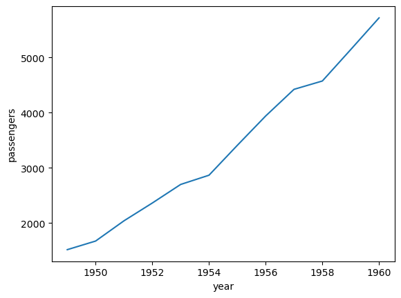

# Day 19: EDA using Bivariate and Multivariate Analysis

Bivariate and Multivariate analysis involves analyzing the relationship between two and more than two variables. This can be done for different types of data:  <br>

● Numerical-Numerical: This involves analyzing the relationship between two numerical variables. This can be done using scatter plots, line plots, or correlation matrices. <br>
● Numerical-Categorical: This involves analyzing the relationship between a numerical variable and a categorical variable. This can be done using box plots or violin plots. <br>
● Categorical-Categorical: This involves analyzing the relationship between two categorical variables. This can be done using contingency tables or stacked bar charts.


```python
import pandas as pd 
import seaborn as sns
tips = sns.load_dataset('tips')
titanic = pd.read_csv('train.csv')
flights = sns.load_dataset('flights')
iris = sns.load_dataset('iris')
```


```python
tips.head()
```


<div>
<style scoped>
    .dataframe tbody tr th:only-of-type {
        vertical-align: middle;
    }

    .dataframe tbody tr th {
        vertical-align: top;
    }

    .dataframe thead th {
        text-align: right;
    }
</style>
<table border="1" class="dataframe">
  <thead>
    <tr style="text-align: right;">
      <th></th>
      <th>total_bill</th>
      <th>tip</th>
      <th>sex</th>
      <th>smoker</th>
      <th>day</th>
      <th>time</th>
      <th>size</th>
    </tr>
  </thead>
  <tbody>
    <tr>
      <th>0</th>
      <td>16.99</td>
      <td>1.01</td>
      <td>Female</td>
      <td>No</td>
      <td>Sun</td>
      <td>Dinner</td>
      <td>2</td>
    </tr>
    <tr>
      <th>1</th>
      <td>10.34</td>
      <td>1.66</td>
      <td>Male</td>
      <td>No</td>
      <td>Sun</td>
      <td>Dinner</td>
      <td>3</td>
    </tr>
    <tr>
      <th>2</th>
      <td>21.01</td>
      <td>3.50</td>
      <td>Male</td>
      <td>No</td>
      <td>Sun</td>
      <td>Dinner</td>
      <td>3</td>
    </tr>
    <tr>
      <th>3</th>
      <td>23.68</td>
      <td>3.31</td>
      <td>Male</td>
      <td>No</td>
      <td>Sun</td>
      <td>Dinner</td>
      <td>2</td>
    </tr>
    <tr>
      <th>4</th>
      <td>24.59</td>
      <td>3.61</td>
      <td>Female</td>
      <td>No</td>
      <td>Sun</td>
      <td>Dinner</td>
      <td>4</td>
    </tr>
  </tbody>
</table>
</div>


```python
titanic.head()
```


<div>
<style scoped>
    .dataframe tbody tr th:only-of-type {
        vertical-align: middle;
    }

    .dataframe tbody tr th {
        vertical-align: top;
    }

    .dataframe thead th {
        text-align: right;
    }
</style>
<table border="1" class="dataframe">
  <thead>
    <tr style="text-align: right;">
      <th></th>
      <th>total_bill</th>
      <th>tip</th>
      <th>sex</th>
      <th>smoker</th>
      <th>day</th>
      <th>time</th>
      <th>size</th>
    </tr>
  </thead>
  <tbody>
    <tr>
      <th>0</th>
      <td>16.99</td>
      <td>1.01</td>
      <td>Female</td>
      <td>No</td>
      <td>Sun</td>
      <td>Dinner</td>
      <td>2</td>
    </tr>
    <tr>
      <th>1</th>
      <td>10.34</td>
      <td>1.66</td>
      <td>Male</td>
      <td>No</td>
      <td>Sun</td>
      <td>Dinner</td>
      <td>3</td>
    </tr>
    <tr>
      <th>2</th>
      <td>21.01</td>
      <td>3.50</td>
      <td>Male</td>
      <td>No</td>
      <td>Sun</td>
      <td>Dinner</td>
      <td>3</td>
    </tr>
    <tr>
      <th>3</th>
      <td>23.68</td>
      <td>3.31</td>
      <td>Male</td>
      <td>No</td>
      <td>Sun</td>
      <td>Dinner</td>
      <td>2</td>
    </tr>
    <tr>
      <th>4</th>
      <td>24.59</td>
      <td>3.61</td>
      <td>Female</td>
      <td>No</td>
      <td>Sun</td>
      <td>Dinner</td>
      <td>4</td>
    </tr>
  </tbody>
</table>
</div>


```python
flights.head()
```


<div>
<style scoped>
    .dataframe tbody tr th:only-of-type {
        vertical-align: middle;
    }

    .dataframe tbody tr th {
        vertical-align: top;
    }

    .dataframe thead th {
        text-align: right;
    }
</style>
<table border="1" class="dataframe">
  <thead>
    <tr style="text-align: right;">
      <th></th>
      <th>year</th>
      <th>month</th>
      <th>passengers</th>
    </tr>
  </thead>
  <tbody>
    <tr>
      <th>0</th>
      <td>1949</td>
      <td>Jan</td>
      <td>112</td>
    </tr>
    <tr>
      <th>1</th>
      <td>1949</td>
      <td>Feb</td>
      <td>118</td>
    </tr>
    <tr>
      <th>2</th>
      <td>1949</td>
      <td>Mar</td>
      <td>132</td>
    </tr>
    <tr>
      <th>3</th>
      <td>1949</td>
      <td>Apr</td>
      <td>129</td>
    </tr>
    <tr>
      <th>4</th>
      <td>1949</td>
      <td>May</td>
      <td>121</td>
    </tr>
  </tbody>
</table>
</div>


## Numerical-Numerical
 This involves analyzing the relationship between two numerical variables. This can be done using scatter plots, line plots, or correlation matrices.

### 1. Scatterplot


```python
sns.scatterplot(x='total_bill', y='tip', hue='sex',style='smoker',size='size', data= tips);
```


    

    


### 2. Lineplot


```python
new=flights.groupby('year').sum().reset_index();
sns.lineplot(x='year', y='passengers', data=new);
```

    /var/folders/s1/prjs0rvs11x47frsjkk0xwyc0000gn/T/ipykernel_23394/1003248860.py:1: FutureWarning: The default value of numeric_only in DataFrameGroupBy.sum is deprecated. In a future version, numeric_only will default to False. Either specify numeric_only or select only columns which should be valid for the function.
      new=flights.groupby('year').sum().reset_index();


    

    


## Numerical-Categorical: 
This involves analyzing the relationship between a numerical variable and a categorical variable. This can be done using box plots or bar plots.

### 1. Bar Plot


```python
sns.barplot(x='Pclass', y='Age', hue='Sex', data=titanic);
```


    

    


### 2. Box Plot


```python
sns.boxplot(x='Sex', y='Age', hue='Survived', data = titanic);
```


    

    


### 3. Distplot


```python
sns.displot(x='Age', hue='Survived',kind='kde', data=titanic);
```


    

    


## Categorical-Categorical: 
This involves analyzing the relationship between two categorical variables. This can be done using contingency tables or stacked bar charts.

### 1. HeatMap


```python
sns.heatmap(pd.crosstab(titanic['Pclass'], titanic['Survived']));
```


    

    


### 2. ClusterMap


```python
sns.clustermap(pd.crosstab(titanic['Pclass'], titanic['Survived']));
```


    

    


## Pairplot

It is used to visualize pairwise relationships between variables in a dataset. It creates a grid of scatter plots and histograms where each variable is plotted against every other variable. This is useful for quickly identifying potential relationships or patterns, as well as outliers or unusual observations. The type of plot on the diagonal can be customized, and the appearance of the plots can be further customized with additional arguments.


```python
sns.pairplot(iris,hue='species');
```


    

    


#### In conclusion, EDA using bivariate and multivariate analysis provides a deeper understanding of data and helps in making better decisions. Different types of data visualization techniques can be used to perform bivariate and multivariate analysis based on the type of data.


```python

```
