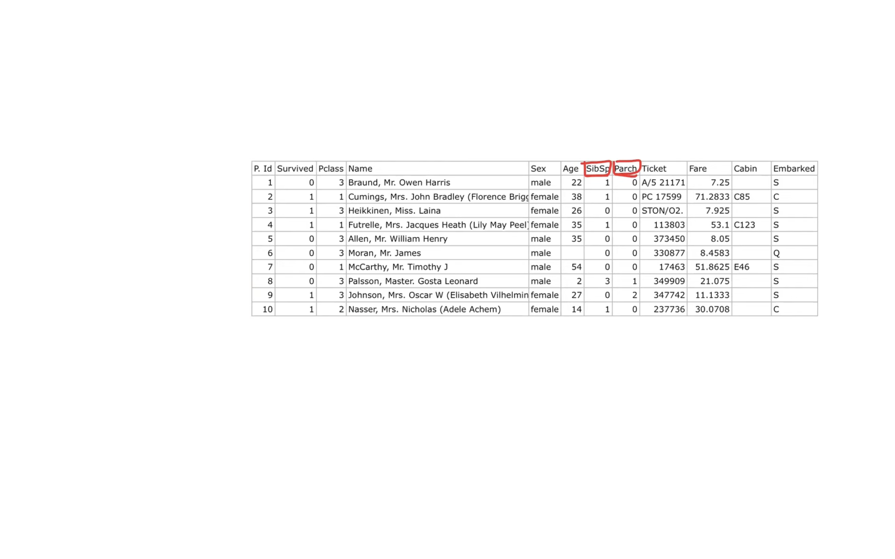

# Day 21: Feature Engineering

Feature engineering is the process of using domain knowledge to extract features (characteristics, properties, attributes) from raw data. These features can be used to improve the performance of machine learning algorithms.

 
Feature engineering consists of creation, transformation, extraction, and selection of features that are used to create an accurate ML algorithm. 

## 1. Feature Transformation

This category involves transforming the data in a way that it becomes more suitable for machine learning algorithms. The different techniques used for feature transformation are:

### a. Missing Value Imputation
Missing data can be a major issue in real-world datasets. In this technique, missing data is imputed or filled in using different methods such as mean or median imputation, forward or backward fill, etc.

### b. Handling Categorical Data
Machine learning algorithms can only work with numerical data, so handling categorical data becomes a crucial part of feature engineering. Techniques such as one-hot encoding, ordinal encoding, and label encoding can be used to handle categorical data. 

### c. Outlier Detection
Outliers are data points that are significantly different from other data points in a dataset. These can be detected using different statistical techniques such as Z-score, IQR, etc. Outliers can be removed, imputed, or transformed to improve the performance of machine learning algorithms.

#### With Outliers

#### Without Outliers

### d. Feature Scaling
Machine learning algorithms can be sensitive to the scale of input features. Feature scaling techniques such as standardization and normalization can be used to scale the input features to a common scale.

If we use this data directly for training a machine learning model, the model might give more weightage to the salary column due to its larger scale, and the age column might be ignored. To avoid this, we can use feature scaling.

## 2. Feature Construction
In feature construction, new features are created from the existing features in a dataset. This can be done using techniques such as interaction features, polynomial features, etc.

Instead of having two separate columns for "SibSp" (number of siblings) and "Parch" (number of parents), we can create a new column called "Family" that combines these two features. The new feature represents the total number of family members on board for each passenger.

## 3. Feature Selection
Feature selection is the process of selecting the most relevant features from a dataset. It plays an important role when passing columns into machine learning models as it helps determine which columns are necessary and which are not, allowing for consideration of only the important features and potentially improving the accuracy of the model. Essentially, it reduces inputs and aids in the discovery of significant features.

## Feature extraction
Feature extraction is the process of extracting new features from existing features in a dataset. It involves transforming or combining the original features in a way that can improve the performance of machine learning algorithms.  
For example, instead of simply counting the number of rooms and bathrooms in a house, we could create a new feature by calculating the total square footage of the living space. This can provide a more informative and predictive feature for the model to use.

#### In conclusion, feature engineering is a critical step in the machine learning pipeline that can significantly improve the performance of machine learning models. 

